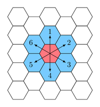
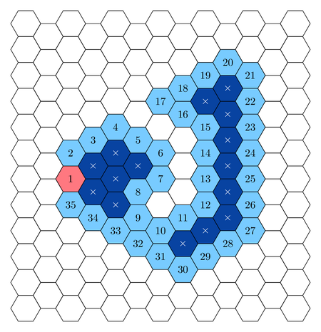
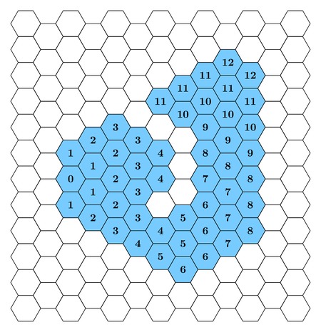

# Hexagonal Territory

Pak Dengklek is standing at a cell, called the initial cell, on an infinite hexagonal tiling.
Two cells in a hexagonal tiling are said to be neighbouring if they share a common side.
In one step, Pak Dengklek can move from one cell to one of its neighbours by moving towards one of the six possible directions, numbered from $1$ to $6$, as illustrated by the following figure.



Pak Dengklek will form a territory by following a path that consists of a sequence of cells that are visited by a sequence of $N$ moves.
The $i$-th move is made by choosing a direction $D[i]$, then performing $L[i]$ steps in the chosen direction.
The path has the following properties:
* The path is *closed*, meaning that the cell at the end of the sequence is the same as the cell at the beginning of the sequence.
* The path is *simple*, meaning that every cell can be visited at most once, except for the initial cell, which is visited exactly twice (at the beginning and at the end).
* The path is *exposed*, meaning that each cell in the path is neighbouring with at least one cell that is not in the path and is not *inside*.
  * A cell is said to be *inside* if it is not in the path and you can only visit a finite number of cells using any sequence of steps without visiting any cell in the path.

The following is an example of a path that can be followed by Pak Dengklek.

* The cell numbered $1$ (shaded pink) is the initial (and final) cell.
* Cells that are numbered (shaded light blue) are cells in the path, numbered in the order they are visited.
* Cells that are crossed (shaded dark blue) are cells that are inside.



The formed territory will consist of all cells that are in the path or are inside.
The distance of a cell $c$ in the territory is the minimum number of steps needed to move from the initial cell to the cell $c$ by visiting only cells in the territory.
The score of a cell in the territory is defined as $A + d \times B$, where $A$ and $B$ are constants predetermined by Pak Dengklek, and $d$ is the distance of the cell in the territory.
The following is the illustration of the distance of each cell in the territory formed using the path from the example above.



Help Pak Dengklek to calculate the total score of all cells in the territory formed by the $N$ moves that he will make. As the total score can be large, calculate it modulo $10^9 + 7$.

## Implementation Details

You should implement the following procedure.

```
int draw_territory(int N, int A, int B, int[] D, int[] L)
```

* $N$: the number of moves.
* $A$, $B$: the constants for the calculation of the scores.
* $D$: an array of length $N$, where $D[i]$ is the direction of the $i$-th move.
* $L$: an array of length $N$, where $L[i]$ is the number of steps made by the $i$-th move.
* This procedure should return the total score of the drawn territory modulo $10^9 + 7$.
* This procedure is called exactly once.

## Examples

Consider the following call:

```
draw_territory(17, 2, 3,
               [1, 2, 3, 4, 5, 4, 3, 2, 1, 6, 2, 3, 4, 5, 6, 6, 1],
               [1, 2, 2, 1, 1, 1, 1, 2, 3, 2, 3, 1, 6, 3, 3, 2, 1])
```

The moves are actually the same as what is illustrated from the description.
The following table lists the score of each cell for every possible distance in the territory.

| Distance | Number of cells | Score of each cell     | Total score         |
| ------------------------------------------------------------------------- |
| $0$      | $1$             | $2 + 0 \times 3 = 2$   | $1 \times 2 = 2$    |
| $1$      | $4$             | $2 + 1 \times 3 = 5$   | $4 \times 5 = 20$   |
| $2$      | $5$             | $2 + 2 \times 3 = 8$   | $5 \times 8 = 40$   |
| $3$      | $6$             | $2 + 3 \times 3 = 11$  | $6 \times 11 = 66$  |
| $4$      | $4$             | $2 + 4 \times 3 = 14$  | $4 \times 14 = 56$  |
| $5$      | $3$             | $2 + 5 \times 3 = 17$  | $3 \times 17 = 51$  |
| $6$      | $4$             | $2 + 6 \times 3 = 20$  | $4 \times 20 = 80$  |
| $7$      | $4$             | $2 + 7 \times 3 = 23$  | $4 \times 23 = 92$  |
| $8$      | $5$             | $2 + 8 \times 3 = 26$  | $5 \times 26 = 130$ |
| $9$      | $3$             | $2 + 9 \times 3 = 29$  | $3 \times 29 = 87$ |
| $10$     | $4$             | $2 + 10 \times 3 = 32$ | $4 \times 32 = 128$ |
| $11$     | $5$             | $2 + 11 \times 3 = 35$ | $5 \times 35 = 175$ |
| $12$     | $2$             | $2 + 12 \times 3 = 38$ | $2 \times 38 = 76$  |

The total score is $2 + 20 + 40 + 66 + 56 + 51 + 80 + 92 + 130 + 87 + 128 + 175 + 76 = 1003$.
Therefore, the procedure `draw_territory` should return $1003$.

## Constraints

* $3 \le N \le 200\,000$
* $0 \le A, B \le 10^9$
* $1 \le D[i] \le 6$ (for all $0 \le i \le N - 1$)
* $1 \le L[i]$ (for all $0 \le i \le N - 1$)
* The sum of all elements of $L$ does not exceed $10^9$.
* The path is closed, simple, and exposed.

## Subtasks

1. (3 points) $N = 3$, $B = 0$
1. (6 points) $N = 3$
1. (11 points) The sum of all elements of $L$ does not exceed $2000$.
1. (12 points) $B = 0$, the sum of all elements of $L$ does not exceed $200\,000$.
1. (15 points) $B = 0$
1. (19 points) The sum of all elements of $L$ does not exceed $200\,000$.
1. (18 points) $L[i] = L[i + 1]$ (for all $0 \le i \le N - 2$)
1. (16 points) No additional constraints.

## Sample Grader

The sample grader reads the input in the following format:

* line $1$: $N \; A \; B$
* line $2 + i$ ($0 \le i \le N - 1$): $D[i] \; L[i]$

The sample grader prints your answer in the following format:

* line $1$: return value of `draw_territory`
