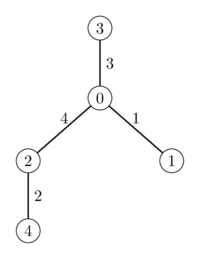
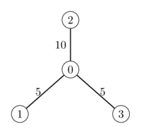

# Road Closures

In the city of Surabaya, there are $N$ junctions, numbered from $0$ to $N - 1$.
These junctions are connected by $N - 1$ bidirectional roads, numbered from $0$ to $N - 2$, such that there is a unique path between any pair of junctions through the roads.
Road $i$ ($0 \le i \le N - 2$) connects junction $U[i]$ and $V[i]$.

To raise environmental awareness, Pak Dengklek, as the mayor of Surabaya, plans to hold a Car Free Day.
To encourage the event, Pak Dengklek will organize road closures.
Pak Dengklek will first choose a non-negative integer $k$, then close some of the roads such that each junction is directly connected to **at most** $k$ roads that are not closed.
The cost to close road $i$ is $W[i]$.

Help Pak Dengklek to find the minimum total cost to close the roads for each possible non-negative integer $k$ ($0 \le k \le N - 1$).

## Implementation Details

You should implement the following procedure:

```
int64[] minimum_closure_costs(int N, int[] U, int[] V, int[] W)
```

* $N$: the number of junctions in Surabaya.
* $U$ and $V$: arrays of size $N - 1$, where junctions $U[i]$ and $V[i]$ are connected by road $i$.
* $W$: an array of size $N - 1$, where $W[i]$ is the cost to close road $i$.
* This procedure should return a single array of size $N$. For each $k$ ($0 \le k \le N - 1$), the $k$-th element is the minimum total cost to close the roads such that each junction is directly connected to at most $k$ roads that are not closed.
* This procedure is called exactly once.

## Examples

### Example 1

Consider the following call:

```
minimum_closure_costs(5, [0, 0, 0, 2], [1, 2, 3, 4], [1, 4, 3, 2])
```

This means there is a total of $5$ junctions and $4$ roads connecting the junction pairs $(0, 1)$, $(0, 2)$, $(0, 3)$, and $(2, 4)$ with closure costs $1$, $4$, $3$, and $2$, respectively.



To obtain the minimum costs:

* if Pak Dengklek chose $k = 0$, then all roads should be closed with a total cost of $1 + 4 + 3 + 2 = 10$;
* if Pak Dengklek chose $k = 1$, then road $0$ and road $1$ should be closed with a total cost of $1 + 4 = 5$;
* if Pak Dengklek chose $k = 2$, then road $0$ should be closed with a total cost of $1$;
* if Pak Dengklek chose $k = 3$ or $k = 4$, then no roads need to be closed.

Therefore, the `minimum_closure_costs` procedure should return $[10, 5, 1, 0, 0]$.

### Example 2

Consider the following call:

```
minimum_closure_costs(4, [0, 2, 0], [1, 0, 3], [5, 10, 5])
```

This means there is a total of $4$ junctions and $3$ roads connecting the junction pairs $(0, 1)$, $(2, 0)$, and $(0, 3)$ with the closure costs $5$, $10$, and $5$ respectively.



To obtain the minimum costs:

* if Pak Dengklek chose $k = 0$, then all roads should be closed with a total cost of $5 + 10 + 5 = 20$;
* if Pak Dengklek chose $k = 1$, then road $0$ and road $2$ should be closed with a total cost of $5 + 5 = 10$;
* if Pak Dengklek chose $k = 2$, then either road $0$ or road $2$ should be closed with a total cost of $5$;
* if Pak Dengklek chose $k = 3$, then no roads need to be closed.

Therefore, the `minimum_closure_costs` procedure should return $[20, 10, 5, 0]$.

## Constraints

* $2 \le N \le 100\,000$
* $0 \le U[i], V[i] \le N - 1$ (for all $0 \le i \le N - 2$)
* It is possible to travel between any pair of junctions through the roads.
* $1 \le W[i] \le 10^9$ (for all $0 \le i \le N - 2$)

## Subtasks

1. (5 points) $U[i] = 0$ (for all $0 \le i \le N - 2$)
1. (7 points) $U[i] = i$, $V[i] = i + 1$ (for all $0 \le i \le N - 2$)
1. (14 points) $N \le 200$
1. (10 points) $N \le 2000$
1. (17 points) $W[i] = 1$ (for all $0 \le i \le N - 2$)
1. (25 points) $W[i] \le 10$ (for all $0 \le i \le N - 2$)
1. (22 points) No additional constraints.

## Sample Grader

The sample grader reads the input in the following format:

* line $1$: $N$
* line $2 + i$ ($0 \le i \le N - 2$): $U[i] \; V[i] \; W[i]$

The sample grader prints a single line containing the array returned by `minimum_closure_costs`.
